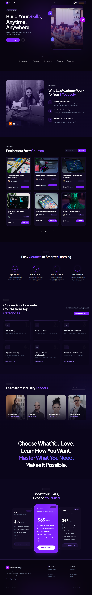
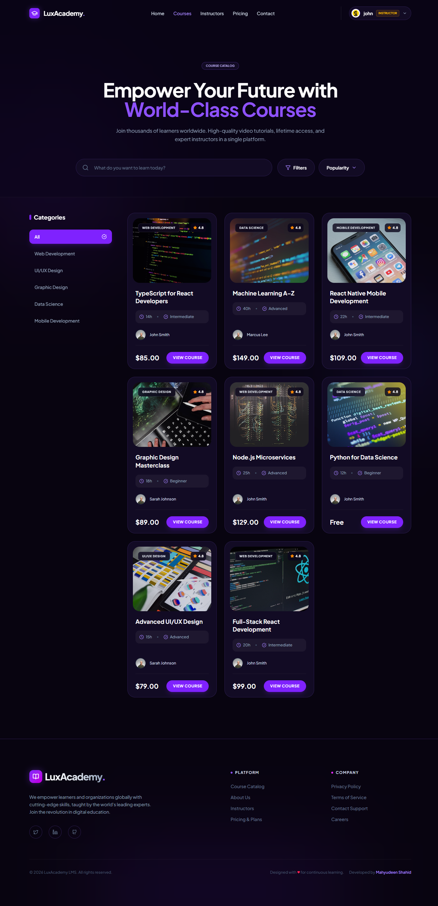
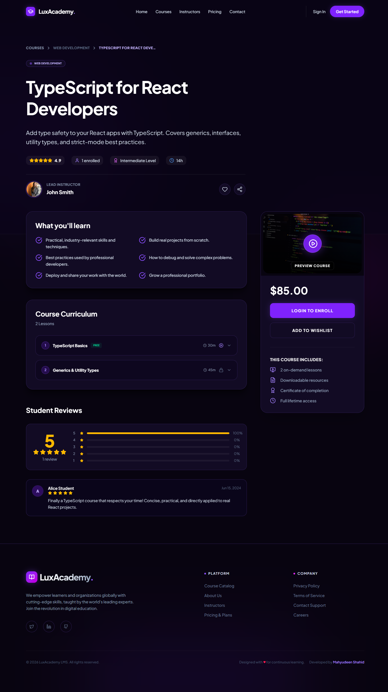
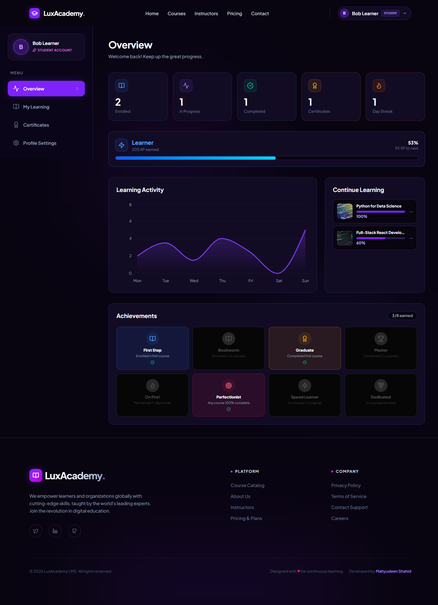
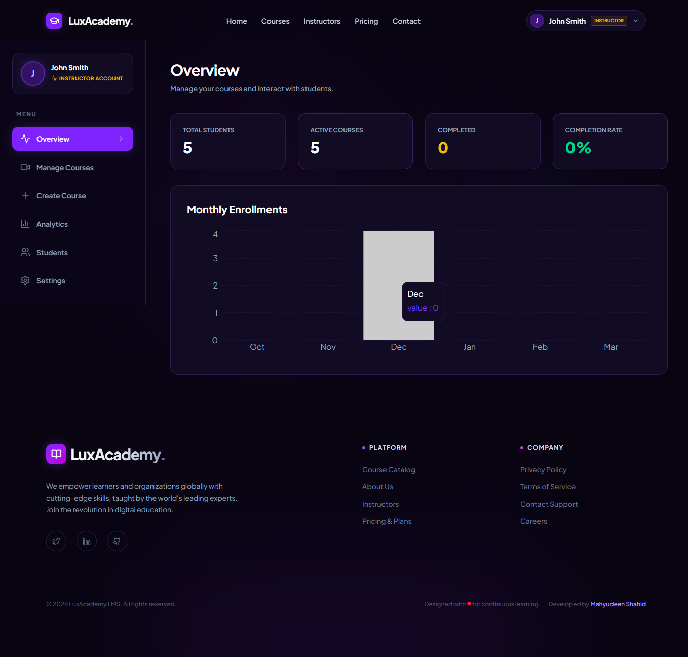
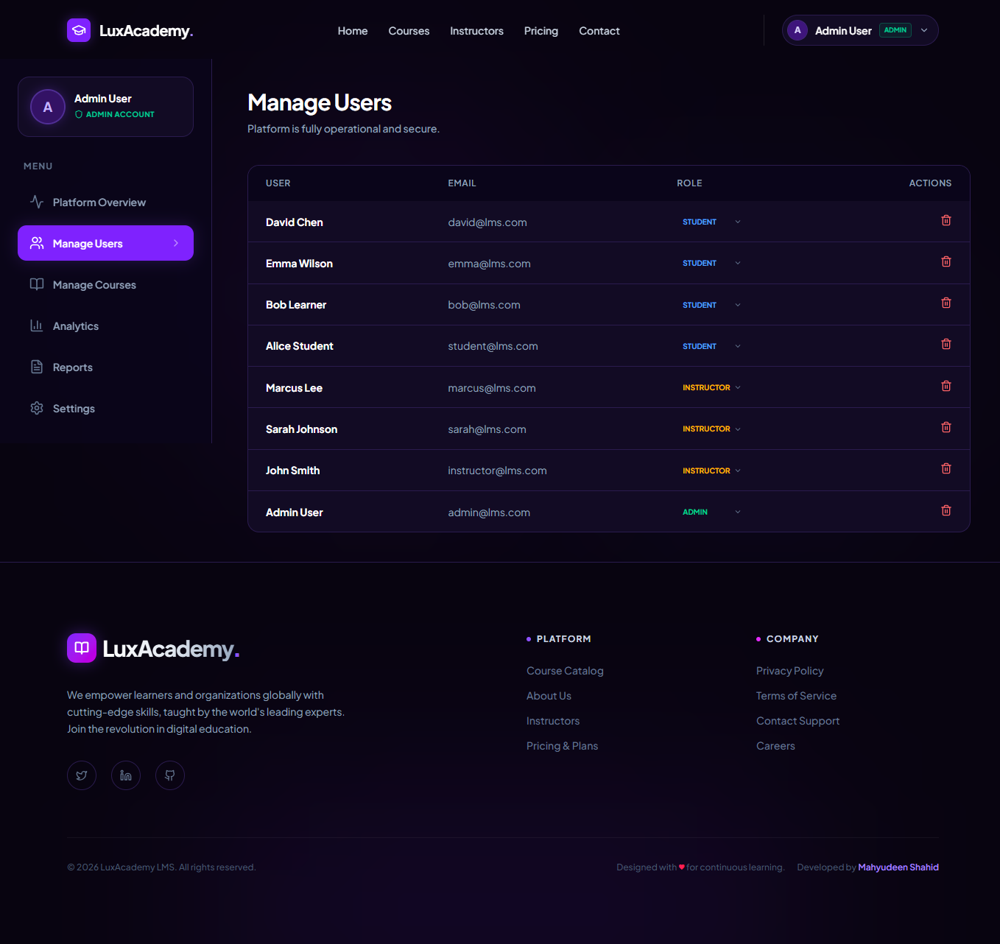
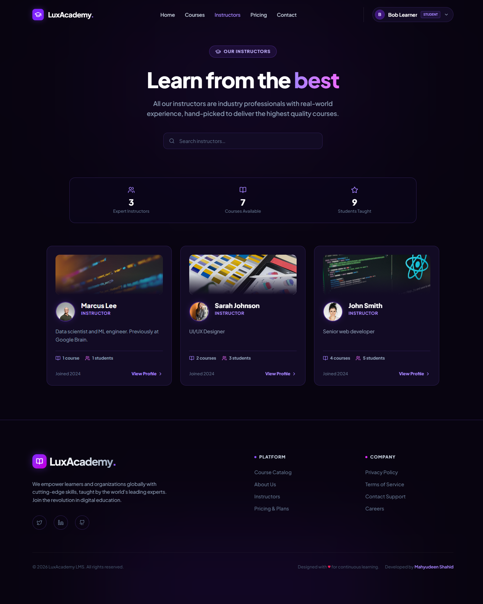
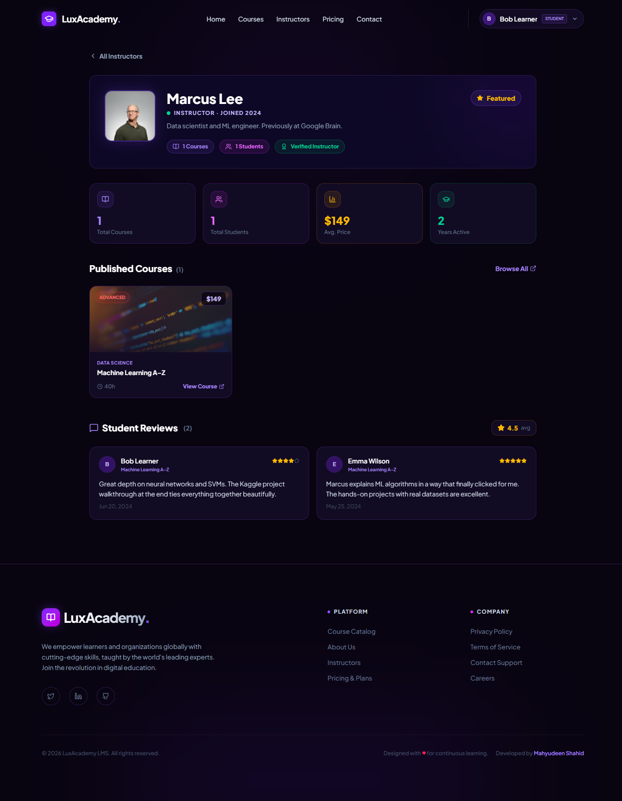
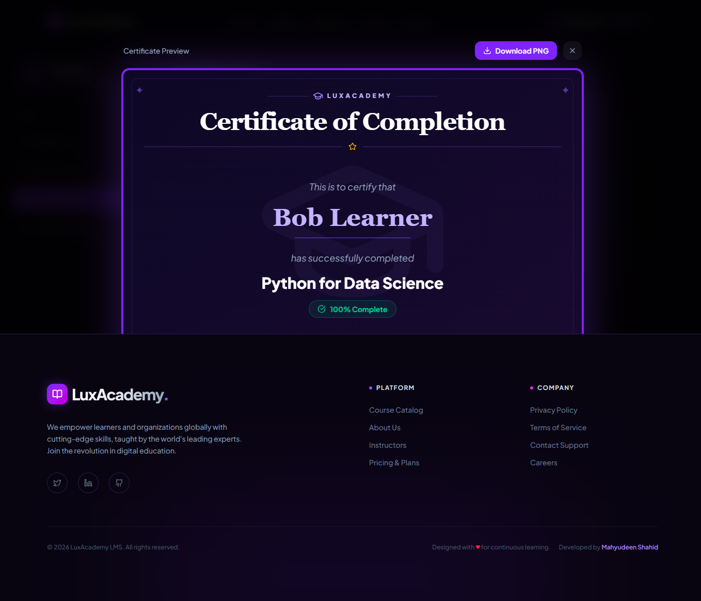

# LuxAcademy — Multi-Tutor Learning Management System

A full-stack **Learning Management System** built with the MERN stack. LuxAcademy supports three user roles (Student, Instructor, Admin), a complete course marketplace, live video lessons, certificates, reviews, and rich analytics — all with a polished dark-themed UI.

---

## Project Overview

LuxAcademy is a production-ready LMS platform where:

- **Students** browse and enrol in courses, track progress, earn certificates, and leave reviews
- **Instructors** create and manage courses, add video lessons, track student enrolments and earnings
- **Admins** manage all users and courses, view platform-wide analytics and reports

The backend runs with or without MongoDB — it automatically falls back to an in-memory mock store so the app works straight out of the box with zero database setup.

---

## Screenshots

### Home Page

> Hero section with course highlights, instructor showcase, and CTA.

### Course Catalogue

> Search, filter by category/level/price. Animated course cards.

### Course Detail + Reviews

> Course overview, lesson curriculum, student reviews with star ratings, and enrolment card.

### Student Dashboard

> XP level, daily streak, progress tracker, and certificate download.

### Instructor Dashboard

> Course management, student enrolments, revenue analytics.

### Admin Dashboard

> Platform analytics, user management, course oversight.

### Instructors Page

> Public listing of all instructors with stats and featured courses.

### Instructor Profile

> Full profile with bio, published courses, and student reviews.

### Certificate Viewer

> Downloadable course completion certificate.

---

## Technologies Used

### Frontend

| Technology | Version | Purpose |
|---|---|---|
| React | 18 | UI framework |
| Vite | 5 | Dev server + build tool |
| React Router v6 | 6 | Client-side routing |
| Tailwind CSS | 3 | Utility-first styling |
| Framer Motion | 11 | Animations + transitions |
| Axios | 1 | HTTP client |
| Lucide React | Latest | Icon library |

### Backend

| Technology | Version | Purpose |
|---|---|---|
| Node.js | ≥18 | JavaScript runtime |
| Express | 4 | REST API framework |
| Mongoose | 8 | MongoDB ODM |
| JSON Web Token | 9 | Stateless authentication |
| bcryptjs | 2 | Password hashing |
| dotenv | 16 | Environment variables |
| morgan | 1 | HTTP request logging |
| cors | 2 | Cross-origin requests |

### Database

| Technology | Notes |
|---|---|
| MongoDB | Primary database (optional — app works without it) |
| In-Memory Mock Store | Auto-used when MongoDB is unavailable |

---

## Prerequisites

- **Node.js** ≥ 18.x
- **npm** ≥ 9.x
- **MongoDB** (optional — app works without it using mock data)

---

## Installation

### 1. Clone the repository

```bash
git clone https://github.com/your-username/project_ecom.git
cd project_ecom
```

### 2. Backend setup

```bash
cd backend
npm install
```

Create a `.env` file in the `backend/` directory:

```env
PORT=5000
MONGO_URI=mongodb://localhost:27017/lms
JWT_SECRET=your_super_secret_key_here
JWT_EXPIRES_IN=30d
NODE_ENV=development
USE_MOCK_DB=true
```

> Set `USE_MOCK_DB=true` to skip MongoDB entirely (recommended for quick start).

### 3. Frontend setup

```bash
cd ../frontend
npm install
```

Create a `.env` file in the `frontend/` directory:

```env
VITE_API_URL=http://localhost:5000/api
```

---

## Running the Application

### Option A — Quick Start (no MongoDB required)

```bash
# Terminal 1 — Backend with mock data
cd backend
node server.js
# → Server starts at http://localhost:5000

# Terminal 2 — Frontend
cd frontend
npm run dev
# → App starts at http://localhost:5173
```

### Option B — With MongoDB

```bash
# 1. Ensure MongoDB is running
# 2. Set USE_MOCK_DB=false in backend/.env
# 3. Seed the database
cd backend
node seed.js

# 4. Start both servers
node server.js       # Terminal 1
cd ../frontend && npm run dev   # Terminal 2
```

---

## Demo Credentials

| Email | Password | Role |
|---|---|---|
| admin@lms.com | password123 | Admin |
| instructor@lms.com | password123 | Instructor |
| sarah@lms.com | password123 | Instructor |
| student@lms.com | password123 | Student |
| bob@lms.com | password123 | Student |

---

## Project Structure

```
project_ecom/
├── backend/                  # Express REST API
│   ├── controllers/          # Route handlers
│   ├── models/               # Mongoose schemas (5 models)
│   ├── routes/               # Express routers
│   ├── middleware/           # Auth + RBAC middleware
│   ├── data/
│   │   └── mockStore.js      # In-memory MongoDB-compatible store
│   ├── config/db.js          # MongoDB connection
│   ├── seed.js               # Database seeder
│   └── server.js             # Entry point
├── frontend/                 # React + Vite SPA
│   └── src/
│       ├── pages/            # Route-level components
│       ├── components/       # Shared UI components
│       ├── services/         # API client layer + mock fallback
│       ├── context/          # Auth context
│       └── routes/           # Route definitions
├── docs/
│   ├── BACKEND.md            # API reference + architecture
│   ├── FRONTEND.md           # Component + service documentation
│   └── DATABASE.md           # Schema + relationship documentation
└── README.md
```

---

## Key Features

| Feature | Description |
|---|---|
| Role-based Auth | JWT authentication with student / instructor / admin roles |
| Course Marketplace | Browse, search, filter courses by category, level, and price |
| Course Creation | Instructors create courses with lessons, thumbnails, video URLs |
| Lesson Viewer | Full-screen video player supporting YouTube and direct video URLs |
| Progress Tracking | Enrollment progress percentage, XP system, daily streaks |
| Certificates | Downloadable course completion certificates |
| Review System | Star ratings + written reviews; one review per enrolled student |
| Instructor Profiles | Public pages showing courses, stats, and student reviews |
| Admin Dashboard | User management, course oversight, platform analytics |
| Offline Fallback | All services gracefully fall back to mock data when API is down |
| Guided Tour | First-login dashboard walkthrough for new users |

---

## API Documentation

See [`docs/BACKEND.md`](docs/BACKEND.md) for the full API reference.

## Frontend Documentation

See [`docs/FRONTEND.md`](docs/FRONTEND.md) for component and service documentation.

## Database Documentation

See [`docs/DATABASE.md`](docs/DATABASE.md) for schema and relationship documentation.

---

## License

MIT — feel free to use this project for learning or as a starting point for your own LMS.
